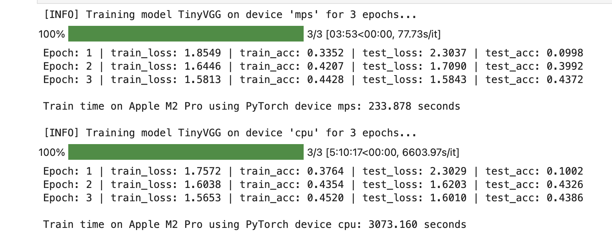

# Data Science and Machine Learning using PyTorch on Apple Silicon
**Apple Silicon Mac (M1 and M2) and would like to set it up for data science and machine learning.

**Requirements:**
* Apple Silicon Mac (M1 and M2).
* macOS Ventura 13.5.2

### Steps

1. Download and install Homebrew from [https://brew.sh](https://brew.sh). Follow the steps it prompts you to go through after installation.
2. [Download Miniforge3](https://github.com/conda-forge/miniforge/releases/latest/download/Miniforge3-MacOSX-arm64.sh) (Conda installer) for macOS arm64 chips (M1, M2, M1 Pro, M1 Max, M1 Ultra).
3. Install Miniforge3 into home directory.

```other
chmod +x Miniforge3-MacOSX-arm64.sh
sh Miniforge3-MacOSX-arm64.sh
source ~/miniforge3/bin/activate
```

4. Restart terminal.
5. Create a directory to setup PyTorch environment.

```other
mkdir pytorch_20_m1_m2
cd pytorch_20_m1_m2
```

6. Make and activate Conda environment. 

> **Note:** 
> I used python 3.11.4


```other
conda create --prefix ./envpytorch20m1m2 python=3.11.4
conda activate ./envpytorch20m1m2
```

7. Install the PyTorch 2.0 default version for Mac with pip from the [PyTorch getting started page](https://pytorch.org/get-started/locally/#mac-anaconda). 

```
pip3 install torch torchvision torchaudio
```

This will install the following: 
> Installing collected packages: urllib3, typing-extensions, pillow, numpy, idna, charset-normalizer, certifi, torch, requests, torchvision

8. Install common data science packages.

```other
conda install jupyter pandas numpy matplotlib scikit-learn tqdm 
```

9. Start Jupyter.

```other
jupyter notebook
```

10. Execute Example.

```other
Run all cell
00_imports_test.ipynb
```
if succeed will got the output

```other
PyTorch version: 2.0.1
Is MPS (Metal Performance Shader) built? True
Is MPS available? True
Using device: mps
```

```other
Run all cell
01_cifar10_tinyvgg.ipynb
```

if succeed will got the output


and the train result in the results folder
```other
apple_m2_pro_cpu_cifar10_image_size.csv
apple_m2_pro_mps_cifar10_image_size.csv
```

also graph

